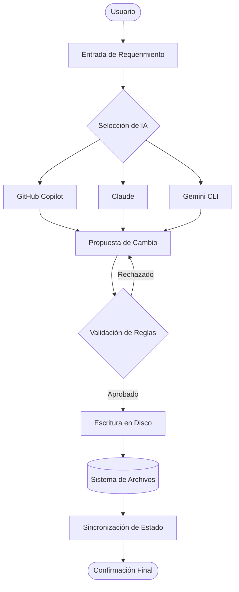

# ARCHITECTURE.md: Diseño y Estructura del Sistema

Este documento define los pilares arquitectónicos y la organización lógica del repositorio. Su función es servir como guía de referencia para mantener la integridad del sistema durante su evolución.

---

## 1. Reglas Generales de Arquitectura

Todo componente integrado en este repositorio debe cumplir con los siguientes principios de diseño:

1.  **Modularidad Estricta:** Las funcionalidades deben estar aisladas. Un cambio en la lógica de un agente o script no debe comprometer la integridad de los demás módulos.
2.  **Documentación de Decisiones (ADR):** Cualquier cambio estructural debe estar justificado por un registro de decisión que explique el "por qué" y no solo el "qué".
3.  **Idempotencia:** Las operaciones de automatización y procesamiento de datos deben producir el mismo resultado independientemente de cuántas veces se ejecuten.
4.  **Nomenclatura Estandarizada:** Se aplica el formato `snake_case` para todo elemento del sistema de archivos, omitiendo el uso de acentos para garantizar la compatibilidad en entornos de terminal.
5.  **Desacoplamiento de IAs:** Los modelos de lenguaje se tratan como componentes intercambiables; el sistema no debe depender de una sola interfaz para su funcionamiento core.

---

## 2. Estructura del Repositorio

La siguiente jerarquía representa la organización de carpetas y su propósito dentro del proyecto:

```yaml
mapa_del_repositorio:
  assets/: "Recursos estaticos como imagenes, diagramas y archivos multimedia"
  config/: "Archivos de configuracion global, esquemas JSON y variables de entorno"
  data/: "Conjuntos de datos, archivos JSON de entrada/salida y registros locales"
  docs/: "Documentacion tecnica, guias de usuario y notas en formato Markdown"
  scripts/: "Scripts de automatizacion en Python y herramientas de utilidad para la terminal"
  src/: "Codigo fuente principal organizado por modulos logicos"
  templates/: "Plantillas base para la generacion de agentes, prompts y documentos"
  tests/: "Scripts de validacion para asegurar la integridad de datos y codigo"
```

---

## 3. Flujo de Datos y Operación

El siguiente diagrama describe el tránsito de la información desde la entrada del usuario hasta la persistencia en el sistema de archivos:



---

## 4. Secciones Obligatorias para Proyectos Derivados

Para asegurar la consistencia, todo proyecto basado en esta plantilla debe incluir en su arquitectura:

* **Visión General:** Resumen ejecutivo de la solución.
* **Pila Tecnológica:** Listado de herramientas, lenguajes y versiones.
* **Diagramas de Secuencia:** Para procesos que involucren múltiples pasos de procesamiento.
* **Análisis de Riesgos:** [SECCIÓN PARA EDICIÓN FUTURA POR IA AGÉNTICA] Identificación de puntos críticos donde la IA podría fallar o alucinar.
* **Registro de Decisiones Arquitectónicas (ADR):** Bitácora cronológica de cambios en el diseño.

---

## 5. Mantenimiento de la Arquitectura

Este archivo no es estático. Se debe revisar al finalizar cada fase de desarrollo para asegurar que la representación gráfica (Mermaid) y el mapa de directorios (YAML) reflejan la realidad actual del repositorio.
